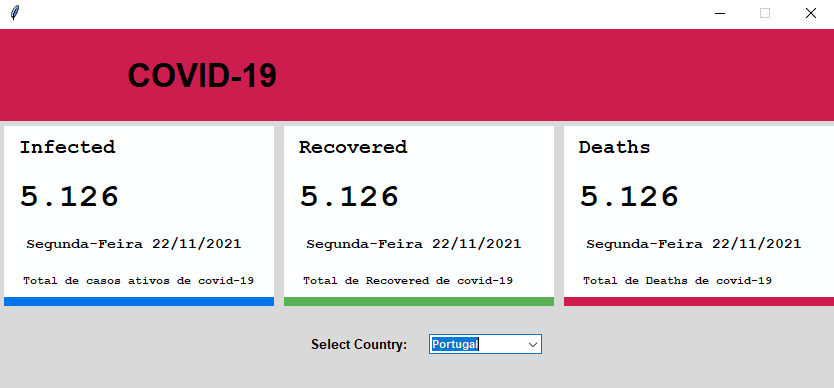

# covid-19-application  

<!---Esses são exemplos. Veja https://shields.io para outras pessoas ou para personalizar este conjunto de escudos. Você pode querer incluir dependências, status do projeto e informações de licença aqui--->

  

> Select your desired country and track the total number of people who are infected, the total number of people who have recovered from the disease and the total number of deaths  

### Adjustments and improvements  

The project is still under development and future updates will focus on the following tasks:  

- [x] Create Frames
- [x] Front end Etructure
- [ ] import API
- [ ] Class Division  

## 💻 Prerequisites  

Before starting, make sure you meet the following requirements:  
<!---Estes são apenas requisitos de exemplo. Adicionar, duplicar ou remover conforme necessário--->
* You have installed the latest version of Python `<linguagem / dependência / requeridos>`
* Do you have a Windows machine `<Windows / Linux / Mac>`.

## 🚀 Install <covid-app>

Para instalar o <covid_19_app>, siga estas etapas:

Linux e macOS:
```
<comando_de_instalação>
```

Windows:
```
<comando_de_instalação>
```

## ☕ Usando <covid_19_app>

Para usar <covid_19_app>, siga estas etapas:

```
<exemplo_de_uso>
```

Adicione comandos de execução e exemplos que você acha que os usuários acharão úteis. Fornece uma referência de opções para pontos de bônus!

## 📫 Contribuindo para <nome_do_projeto>
<!---Se o seu README for longo ou se você tiver algum processo ou etapas específicas que deseja que os contribuidores sigam, considere a criação de um arquivo CONTRIBUTING.md separado--->
Para contribuir com <nome_do_projeto>, siga estas etapas:

1. Bifurque este repositório.
2. Crie um branch: `git checkout -b <nome_branch>`.
3. Faça suas alterações e confirme-as: `git commit -m '<mensagem_commit>'`
4. Envie para o branch original: `git push origin <nome_do_projeto> / <local>`
5. Crie a solicitação de pull.

Como alternativa, consulte a documentação do GitHub em [como criar uma solicitação pull](https://help.github.com/en/github/collaborating-with-issues-and-pull-requests/creating-a-pull-request).

## 🤝 Colaboradores

Agradecemos às seguintes pessoas que contribuíram para este projeto:

<table>
  <tr>
    <td align="center">
      <a href="#">
        <br>
          <b>Gabriel Vogel</b>
        </sub>
      </a>
    </td>
    <tr>
    <td align="center">
      <a href="#">
        <br>
          <b>Wolfgang Unger</b>
        </sub>
      </a>
    </td>
</table>


## 😄 Seja um dos contribuidores<br>

Quer fazer parte desse projeto? Clique [AQUI](CONTRIBUTING.md) e leia como contribuir.

## 📝 Licença

Esse projeto está sob licença. Veja o arquivo [LICENÇA](LICENSE.md) para mais detalhes.

[⬆ Voltar ao topo](#nome-do-projeto)<br>
